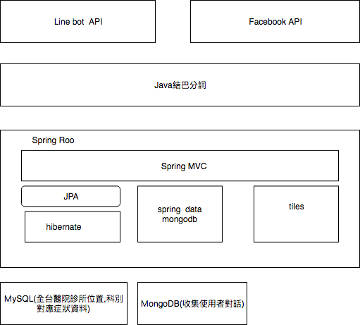

# cbh
看病要看什麼科 line  chatbot 測試。    
 
功能：      
     輸入病狀,回復可能症狀的科別   
     輸入地點,回復可能醫院位置     

系統架構說明              

後台管理網站:

  https://tommy770221.com/cbh/diseases?page=1&size=10

目錄說明：
 
src/main/java/com/cbh/web   spring mvc controller         
src/main/java/com/cbh/service   spring data repository    
src/main/java/com/cbh/mongo      mongodb entity           
src/main/java/com/cbh/entity    spring roo entity         
src/main/java/com/cbh/geo/util/GeoUtil.java  醫院地址定位   
src/main/java/com/cbh/facebook/util/         facebook chatbot managment     
src/main/java/com/cbh/web/FacebookWebhookController.java   facebook  chatbot   
src/main/java/com/cbh/web/LineBotController.java           line chatbot  
src/main/resources/chatbottest2.sql           整理好的病狀資料  
src/main/resources/病症分詞.txt   java結巴分詞訓練語料檔    
src/main/resources/META-INF/persistence.xml    DB相關設定  
src/main/resources/META-INF/spring/applicationContext.xml    spring 設定檔  
src/main/webapp/WEB-INF/layouts/      tiles layout template設定  
src/main/webapp/WEB-INF/views/*/views.xml   tiles 設定   

打包war檔            
mvn clean package   

本地開發  
mvn clean tomcat7:run  

測試chatbot的 line 帳號 ：   
  
